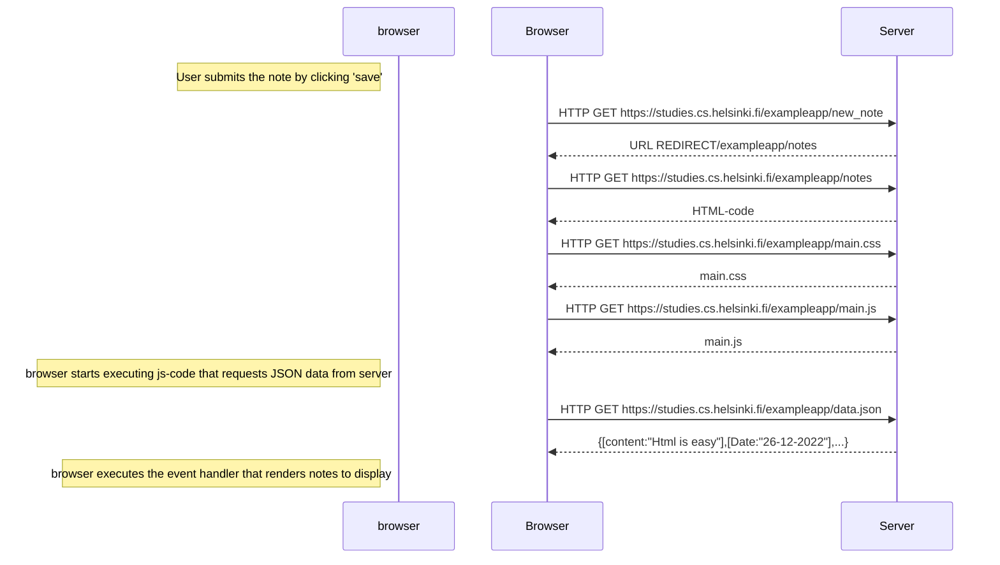

```mermaid
sequenceDiagram
    note left of browser: User submits the note by clicking 'save'
    Browser->>Server: HTTP GET https://studies.cs.helsinki.fi/exampleapp/new_note;
    Server -->> Browser :URL REDIRECT/exampleapp/notes;
    Browser->>Server: HTTP GET https://studies.cs.helsinki.fi/exampleapp/notes;
    Server -->> Browser : HTML-code;
    Browser ->> Server : HTTP GET https://studies.cs.helsinki.fi/exampleapp/main.css;
    Server -->> Browser : main.css;
    Browser ->> Server : HTTP GET https://studies.cs.helsinki.fi/exampleapp/main.js;
    Server -->> Browser : main.js;

    note left of  browser: browser starts executing js-code that requests JSON data from server 

    Browser ->> Server : HTTP GET https://studies.cs.helsinki.fi/exampleapp/data.json;
    Server -->> Browser : {[content:"Html is easy"],[Date:"26-12-2022"],...};

    note left of browser: browser executes the event handler that renders notes to display

```