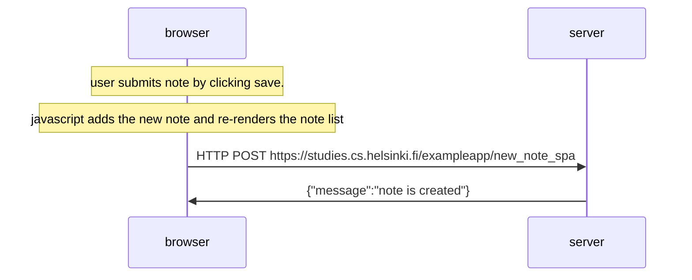

```mermaid
sequenceDiagram

note over browser: user submits note by clicking save.
note over browser: javascript adds the new note and  re-renders the note list
browser->>server: HTTP POST https://studies.cs.helsinki.fi/exampleapp/new_note_spa

server->>browser: {"message":"note is created"}

```